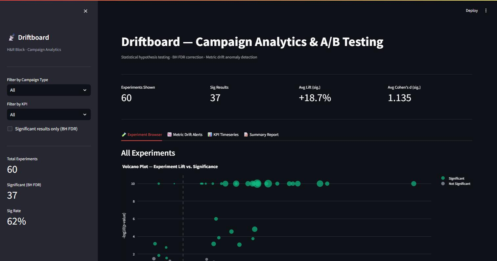
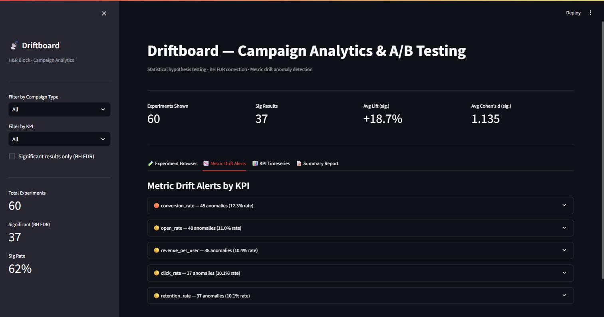
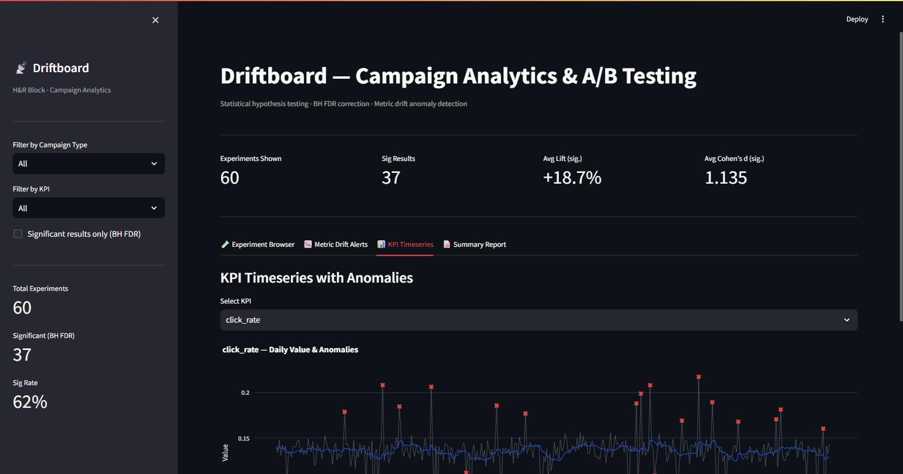
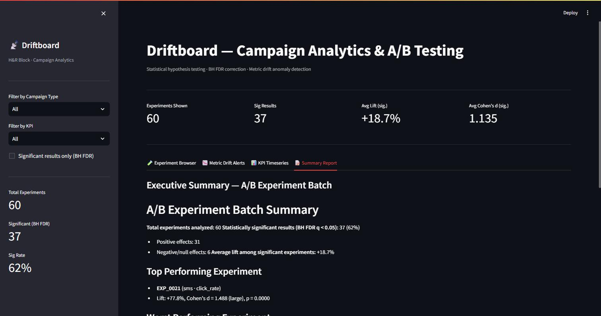

# Campaign Analytics and A/B Testing Platform with Metric Drift Detection

End-to-end campaign analytics pipeline that runs statistical hypothesis testing across 50+ marketing experiments, applies Benjamini-Hochberg FDR correction, detects metric drift in business KPIs using IQR and Z-score anomaly detection, and delivers findings through a Streamlit dashboard with auto-generated executive summaries.

---

## Dashboard Preview

### Experiment Browser — Volcano Plot


### Metric Drift Alerts by KPI


### KPI Timeseries with Anomaly Detection


### Executive Summary Report


---

## Tech Stack

Python · SciPy · statsmodels · Pandas · Streamlit · Plotly · AWS Athena · GitHub Actions

---

## Quickstart

```bash
# 1. Clone and enter the repo
git clone https://github.com/pratheekeranki/driftboard.git
cd driftboard

# 2. Create a virtual environment
python -m venv venv
source venv/bin/activate   # Windows: venv\Scripts\activate

# 3. Install dependencies
pip install -r requirements.txt

# 4. Copy and configure environment variables
cp .env.example .env
# edit .env with your AWS Athena credentials (optional — synthetic data used by default)

# 5. Run the full pipeline (generates data, A/B analysis, drift detection)
python src/run_pipeline.py

# 6. Launch the Streamlit dashboard
streamlit run src/dashboard.py
```

---

## Environment Variables

| Variable | Description |
|---|---|
| `AWS_ACCESS_KEY_ID` | AWS credentials for Athena |
| `AWS_SECRET_ACCESS_KEY` | AWS secret key |
| `AWS_DEFAULT_REGION` | AWS region (default: `us-east-1`) |
| `ATHENA_DATABASE` | Athena database name |
| `ATHENA_OUTPUT_BUCKET` | S3 path for Athena query results |
| `NVIDIA_API_KEY` | NVIDIA NIM API key |
| `DATA_DIR` | Local directory for outputs (default: `data`) |
| `ALPHA` | Statistical significance threshold (default: `0.05`) |
| `ZSCORE_THRESHOLD` | Z-score anomaly threshold (default: `3.0`) |
| `ROLLING_WINDOW_DAYS` | Rolling window for drift detection (default: `14`) |

---

## Folder Structure

```
driftboard/
├── src/
│   ├── data_loader.py       # Athena/SQL pull + synthetic data generation
│   ├── ab_testing.py        # A/B framework: z-test, t-test, BH FDR, summaries
│   ├── drift_detection.py   # IQR + Z-score anomaly detection, plots
│   ├── dashboard.py         # Streamlit dashboard
│   └── run_pipeline.py      # End-to-end pipeline entry point
├── data/                    # Generated CSVs, plots, and reports
├── docs/
│   └── screenshots/         # Dashboard screenshots
├── tests/
│   ├── test_ab_testing.py
│   └── test_drift_detection.py
├── .env
├── requirements.txt
├── .gitignore
└── README.md
```

---

## Example Usage

```python
from src.data_loader import load_experiments, load_kpi_timeseries
from src.ab_testing import run_ab_analysis, generate_summary
from src.drift_detection import run_drift_detection

# Load experiment data
df_exps = load_experiments()

# Run A/B analysis with BH FDR correction
results = run_ab_analysis(df_exps)
print(results[["experiment_id", "relative_lift_pct", "significant_bh"]])

# Auto-generate executive summary
summary = generate_summary(results)
print(summary)

# Detect metric drift
df_ts = load_kpi_timeseries()
df_anom, report = run_drift_detection(df_ts, save_dir="data")
print(report[["kpi", "anomaly_rate", "drift_severity"]])
```

---

## Key Results

- **60 A/B experiments** analyzed across email, SMS, push notification, display ad, and direct mail campaigns
- **37 statistically significant results** (62% sig. rate) after Benjamini-Hochberg FDR correction
- **+18.7% average lift** among significant experiments; top experiment (EXP_0021, SMS · click_rate) delivered **+77.8% lift** with Cohen's d = 1.488 (large)
- **Drift detection** flagged anomalies across all 5 KPIs; `conversion_rate` showed highest drift rate (12.3%, severity: high)
- **Streamlit dashboard** gives marketing teams a self-serve interface: filter by campaign type or KPI, view volcano plots, per-KPI drift timeseries with rolling mean ± 2σ bands, and auto-generated executive summaries

---

## Running Tests

```bash
pytest tests/ -v
```
